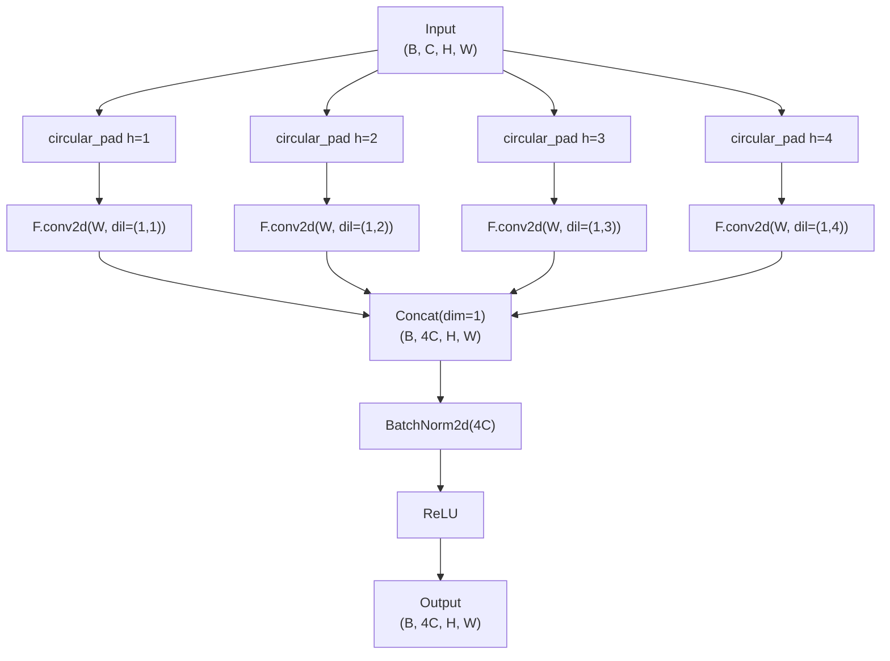
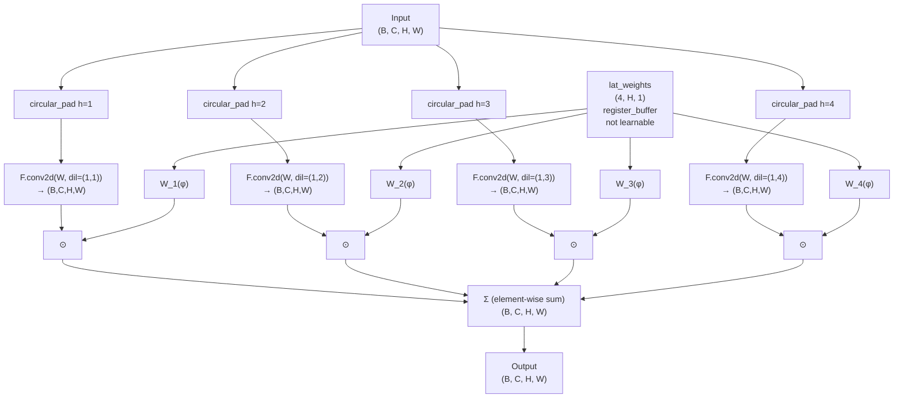
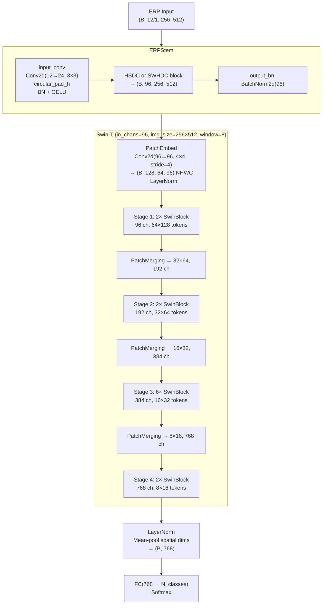
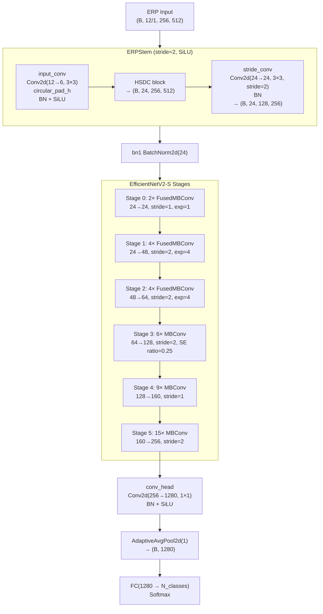
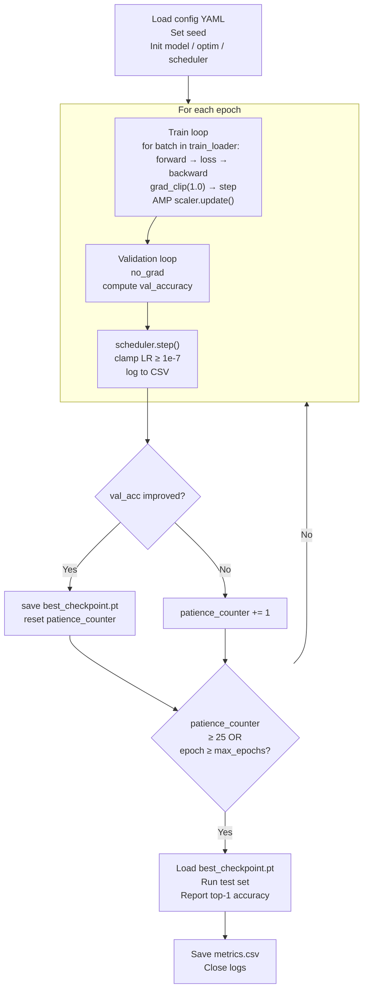

# Technical Documentation
## ERP-ViT 3D Classification — Integrating Vision Transformer Backbones with Horizontally Dilated Convolutions for Equirectangular 3D Object Classification

**TCC — Instituto de Informática, UFRGS**
**Author:** (student name)
**Advisor:** Prof. Cláudio R. Jung
**References:** Stringhini et al. (IEEE ICIP 2024), Stringhini et al. (SIBGRAPI 2024)

---

## Table of Contents

1. [Overview](#1-overview)
2. [Problem Formulation](#2-problem-formulation)
3. [Dataset](#3-dataset)
4. [Spherical Imaging and Equirectangular Projection](#4-spherical-imaging-and-equirectangular-projection)
5. [Preprocessing Pipeline](#5-preprocessing-pipeline)
6. [Data Augmentation](#6-data-augmentation)
7. [Distortion-Correction Blocks](#7-distortion-correction-blocks)
8. [Neural Network Architectures](#8-neural-network-architectures)
9. [Training Protocol](#9-training-protocol)
10. [Evaluation Strategy](#10-evaluation-strategy)
11. [Repository Structure](#11-repository-structure)
12. [References](#12-references)

---

## 1. Overview

This work extends the ERP-based 3D object classification pipeline introduced in the HSDC (Stringhini et al., ICIP 2024) and SWHDC (Stringhini et al., SIBGRAPI 2024) papers by replacing their ResNet-based backbones with Vision Transformer architectures — specifically **Swin Transformer (Swin-T)** and **EfficientNetV2-S**.

The pipeline converts 3D mesh objects into single equirectangular (ERP) panoramic images and classifies them using a neural network that includes a distortion-correction block at the input stage. The core research question is:

> *Does the structural inductive bias of the HSDC/SWHDC blocks — which compensate for ERP's non-uniform spatial sampling — remain beneficial when the downstream backbone uses self-attention rather than convolution?*

**Direct motivation from prior work:** The SWHDC paper already tested a PanoFormer (ViT-based) encoder on this task and obtained only 85.74% on ModelNet10 and 79.71% on ModelNet40, far below the ResNet-50+SWHDC result of 94.11% / 91.89%. The authors attributed this to the *data-hungry nature of transformers*. Swin-T's hierarchical architecture and shifted-window attention are substantially more data-efficient than vanilla ViT, making it a principled candidate for re-investigation.

**Summary of configurations evaluated:**

| Backbone | Block | Channels in | Expected MN10 | Params (est.) |
|---|---|---|---|---|
| ResNet-34 (baseline) | HSDC | 12 | 97.1%† | 5.3M |
| ResNet-50 (baseline) | SWHDC | 1 | 94.1%† | 25.5M |
| PanoFormer ViT (reference) | — | 1 | 85.74%† | — |
| **Swin-T** | **HSDC** | **12** | **TBD** | **~28M** |
| **Swin-T** | **SWHDC** | **1** | **TBD** | **~28M** |
| **EfficientNetV2-S** | **HSDC** | **12** | **TBD** | **~21.4M** |
| **EfficientNetV2-S** | **SWHDC** | **1** | **TBD** | **~21.4M** |

† Reported in original papers. Bold rows are this work's contributions.

---

## 2. Problem Formulation

### 2.1 Task Definition

Given a 3D mesh object $\mathcal{M}$ represented as a set of triangular faces, classify it into one of $N$ semantic categories. Formally:

$$f_\theta : \mathcal{M} \rightarrow \{1, \ldots, N\}$$

The function $f_\theta$ is implemented as a neural network parameterised by $\theta$. The intermediate representation is a single multi-channel ERP image $\mathbf{I} \in \mathbb{R}^{C \times H \times W}$ derived from $\mathcal{M}$.

### 2.2 Classification Strategy Categories

Methods for 3D object classification fall into three families:

| Family | Examples | Limitation |
|---|---|---|
| **Point-based** | PointNet, PointNet++, PointMLP | Sensitive to sampling strategy; mesh→point-cloud conversion required |
| **Voxel-based** | VoxNet, 3DShapeNet | Computationally intensive at high resolution |
| **View-based** | MVCNN, RotationNet, HSDCNet | Information loss; distortions in projections |

This work falls into the view-based category, specifically the **single-view** sub-family. A single omnidirectional ERP captures the complete 3D shape without the viewpoint selection problem.

### 2.3 Key Challenges

1. **ERP distortion**: Equirectangular projection samples the sphere non-uniformly. Regions near the poles are oversampled relative to the equatorial regions. Standard convolutions with fixed-size kernels apply identical support at every latitude, misaligning with the underlying spherical geometry.

2. **Limited data**: ModelNet10 contains only 3,991 training meshes; ModelNet40 contains 9,843. This is far below ImageNet scale (1.28M), which disadvantages data-hungry architectures such as vanilla ViT.

3. **Aspect ratio**: ERP images have a 2:1 width-to-height ratio (512×256). Standard backbone architectures assume square inputs.

---

## 3. Dataset

### 3.1 ModelNet

**Source:** Princeton ModelNet benchmark (Wu et al., CVPR 2015).

**ModelNet10 (MN10):**
- 10 object categories: bathtub, bed, chair, desk, dresser, monitor, night stand, sofa, table, toilet
- Training: 3,991 meshes
- Test: 908 meshes
- Used split: preset official split + 80/20 train/validation from training set

**ModelNet40 (MN40):**
- 40 object categories
- Training: 9,843 meshes
- Test: 2,468 meshes
- Used split: same protocol as MN10

### 3.2 Data Preparation

**Directory structure expected:**
```
data/raw/
├── modelnet10/
│   ├── bathtub/
│   │   ├── train/
│   │   │   ├── bathtub_0001.off
│   │   │   └── ...
│   │   └── test/
│   └── ...
└── modelnet40/
    └── ...
```

**ERP cache directory (generated by preprocessing):**
```
data/processed/
├── modelnet10/
│   ├── hsdc/                  ← 12-channel ERPs (.npy)
│   └── swhdc/                 ← 1-channel ERPs (.npy)
└── modelnet40/
    ├── hsdc/
    └── swhdc/
```

Mesh files are in `.off` format. Some files also appear as `.obj`. Both are supported by trimesh.

### 3.3 Train/Validation/Test Splits

| Split | Source directory | Fraction | Usage |
|---|---|---|---|
| `train` | `<class>/train/` | 80% of files | Gradient updates, augmentation applied |
| `val` | `<class>/train/` | 20% of files | Early stopping criterion |
| `test` | `<class>/test/` | 100% of files | Final evaluation only — never for model selection |

The 80/20 split is deterministic: a fixed `seed=42` numpy RNG shuffles the preset training files and divides them. This ensures reproducibility across all experiments (SWHDC paper §IV-A).

---

## 4. Spherical Imaging and Equirectangular Projection

### 4.1 Spherical Camera Model

A virtual spherical camera is positioned at the centroid $\mathbf{c} \in \mathbb{R}^3$ of the 3D mesh. The centroid is the area-weighted average of the triangle centroids:

$$\mathbf{c} = \frac{\sum_{i=1}^{T} a_i \, \mathbf{c}_i}{\sum_{i=1}^{T} a_i}$$

where $T$ is the number of triangles, $a_i$ is the area of triangle $i$, and $\mathbf{c}_i$ is its geometric centroid. This formulation is numerically stable even for non-uniformly meshed objects.

A spherical surface point $\mathbf{p} \in \mathbb{S}^2$ is parameterised by longitudinal angle $\theta \in [0, 2\pi)$ and latitudinal angle $\phi \in [0, \pi)$:

$$\mathbf{p} = \begin{bmatrix} \cos\theta \sin\phi \\ \sin\theta \sin\phi \\ \cos\phi \end{bmatrix} \quad \text{(HSDC Eq. 1 / SWHDC Eq. 1)}$$

### 4.2 Equirectangular Projection (ERP)

The ERP maps spherical coordinates $(\theta, \phi)$ to pixel position $(x, y)$ in a $w \times h$ image (HSDC Eq. 2 / SWHDC Eq. 2):

$$x = \left\lfloor \frac{\theta \, w}{2\pi} \right\rfloor, \qquad y = \left\lfloor \frac{\phi \, h}{\pi} \right\rfloor$$

The inverse mapping uses pixel-centre sampling:

$$\theta(x) = \frac{2\pi (x + 0.5)}{w}, \qquad \phi(y) = \frac{\pi (y + 0.5)}{h}$$

**Parameters used in both papers:** $w = 512$, $h = 256$.

### 4.3 Distortion Analysis

For a fixed latitude $\phi$, the geodesic distance on the sphere between two points with longitudes $\theta_1$ and $\theta_2$ is:

$$d_\text{horizontal} = |\theta_1 - \theta_2| \sin\phi$$

The ERP pixel distance for the same point pair is $|\theta_1 - \theta_2| \cdot w / (2\pi)$, regardless of $\phi$. Thus, pixels near the poles ($\phi \to 0$ or $\phi \to \pi$) are oversampled by a factor of $1/\sin\phi$ in the horizontal direction relative to the equator.

Conversely, for a fixed longitude $\theta$, the geodesic distance between two points with latitudes $\phi_1$ and $\phi_2$ is $|\phi_1 - \phi_2|$, which is constant. Vertical sampling is thus uniform.

**Implication for convolution:** A standard $k \times k$ kernel has the same horizontal support at every latitude. Near the poles, this support covers a larger effective area on the sphere than at the equator. This mismatch motivates both the HSDC and SWHDC blocks, which adapt the horizontal receptive field based on latitude.

```
Latitude   Distortion factor (1/sin(φ))   Ideal dilation rate
  φ = π/2  (equator)   1.0                    1
  φ = π/3             1.15                    1
  φ = π/6             2.0                     2
  φ = π/12            3.86                    4
  φ → 0   (pole)      ∞                       capped at N
```

---

## 5. Preprocessing Pipeline

### 5.1 Ray Casting

For each pixel $(x, y)$ in the ERP image, a ray is cast from the centroid $\mathbf{c}$ in the direction $\mathbf{p}(\theta(x), \phi(y))$ (Eq. 1). The ray may intersect the mesh at zero, one, or multiple points.

**Intersection handling (HSDC paper §II-B):**
- Zero intersections: ERP pixel is set to 0 across all channels.
- One intersection: Treated as both first and last hit (replicated).
- Multiple intersections: Sorted by distance; first ($d_1$) and last ($d_n$) are retained.

**Implementation:** Trimesh's `ray.intersects_location(multiple_hits=True)` is used. Rays are processed in batches of 32,768 to bound memory usage. For each hit, the distance from $\mathbf{c}$, the face normal, and the triangle index are recorded.

### 5.2 12-Channel HSDC Feature Extraction

Each object is represented by a $(12, 256, 512)$ float32 tensor (HSDC paper §II-B). The 12 channels encode local geometry at the first ($f$) and last ($n$) intersection points:

| Ch | Group | Feature | Description |
|---|---|---|---|
| 0 | First | $d_f$ | Depth: $\|P_f - \mathbf{c}\|_2$ / max distance |
| 1–3 | First | $N^f_x, N^f_y, N^f_z$ | Face normal at first intersection |
| 4 | First | $\text{align}_f$ | $\cos(\angle(\mathbf{p}, \mathbf{n}_f))$ |
| 5 | First | $\text{grad}_f$ | Gradient magnitude of $d_f$ (Gaussian $\sigma=2$) |
| 6 | Last | $d_n$ | Depth: $\|P_n - \mathbf{c}\|_2$ / max distance |
| 7–9 | Last | $N^n_x, N^n_y, N^n_z$ | Face normal at last intersection |
| 10 | Last | $\text{align}_n$ | $\cos(\angle(\mathbf{p}, \mathbf{n}_n))$ |
| 11 | Last | $\text{grad}_n$ | Gradient magnitude of $d_n$ (Gaussian $\sigma=2$) |

**Surface normals:** Computed as the normalised cross-product of the two edge vectors of the intersected triangle:
$$\mathbf{n} = \frac{(\mathbf{v}_2 - \mathbf{v}_1) \times (\mathbf{v}_3 - \mathbf{v}_1)}{\|(\mathbf{v}_2 - \mathbf{v}_1) \times (\mathbf{v}_3 - \mathbf{v}_1)\|_2}$$

**Ray-normal alignment:** Dot product of unit ray direction and unit face normal:
$$\text{align} = \mathbf{p}(\theta, \phi) \cdot \mathbf{n}$$

Value in $[-1, 1]$. Positive indicates the normal faces the ray origin (front face); negative indicates back face.

**Gradient magnitude:** First-order Gaussian derivatives along both axes (scipy `gaussian_filter`):
$$\text{grad}(d) = \sqrt{\left(\frac{\partial G_\sigma * d}{\partial x}\right)^2 + \left(\frac{\partial G_\sigma * d}{\partial y}\right)^2}, \quad \sigma = 2$$

**Depth normalisation:** All distances are divided by the maximum distance across all hit points for that object, yielding values in $[0, 1]$.

### 5.3 1-Channel SWHDC Feature Extraction

The SWHDC pipeline produces a $(1, 256, 512)$ float32 depth map encoding only the last intersection:

$$\mathbf{I}^{(1)}[y, x] = \begin{cases} d_n(x, y) / d_{\max} & \text{if ray hits mesh} \\ 0 & \text{otherwise} \end{cases}$$

where $d_{\max}$ is the maximum $d_n$ across all hit pixels for the object. This produces an *external depth map* of the object (SWHDC paper §IV-A, Fig. 5).

### 5.4 Pre-computation and Caching

Ray casting is expensive (~2–10 seconds per mesh depending on complexity). All ERP images are pre-computed once and saved as `.npy` files. During training, the DataLoader loads cached arrays and applies augmentation on-the-fly.

**Storage estimates:**
- MN10 HSDC cache: 3,991 × 12 × 256 × 512 × 4 bytes ≈ 3.1 GB
- MN10 SWHDC cache: 3,991 × 1 × 256 × 512 × 4 bytes ≈ 0.26 GB
- MN40 HSDC cache: 9,843 × 12 × 256 × 512 × 4 bytes ≈ 7.6 GB

**Pre-computation command:**
```bash
python -m src.preprocessing.dataset \
    --data_root data/raw/modelnet10 \
    --cache_dir data/processed/modelnet10/hsdc \
    --pipeline hsdc
```

---

## 6. Data Augmentation

Augmentation is applied only to training samples, independently per primitive, with a fixed probability of 15% (HSDC §III-A / SWHDC §IV-A).

### 6.1 3D Rotation

The ERP is treated as a spherical signal. A 3D rotation $\mathbf{R} \in SO(3)$ is parameterised by Euler angles:

$$R_x \sim \mathcal{U}[0°, 15°], \quad R_y \sim \mathcal{U}[0°, 15°], \quad R_z \sim \mathcal{U}[0°, 45°]$$

The rotation is applied directly in ERP space via inverse spherical remapping:

1. For each output pixel $(x_\text{out}, y_\text{out})$, compute direction $\mathbf{d}_\text{out}$ via Eq. (1).
2. Apply inverse rotation: $\mathbf{d}_\text{src} = \mathbf{R}^{-1} \mathbf{d}_\text{out}$.
3. Convert $\mathbf{d}_\text{src}$ back to $(\theta_\text{src}, \phi_\text{src})$:
   $$\phi_\text{src} = \arccos(d_z), \quad \theta_\text{src} = \text{atan2}(d_y, d_x) \bmod 2\pi$$
4. Map to source pixel coordinates via Eq. (2).
5. Bilinear interpolation with circular horizontal boundary (wrap) and clamped vertical boundary (nearest).

For the z-axis rotation, this simplifies to a horizontal circular shift of the ERP.

### 6.2 Gaussian Blur

Applied channel-wise:

$$\mathbf{I}_\text{aug}[c] = G_\sigma * \mathbf{I}[c], \quad \sigma \sim \mathcal{U}[0.1, 2.0]$$

### 6.3 Gaussian Noise

Additive noise sampled independently per pixel and channel:

$$\mathbf{I}_\text{aug} = \mathbf{I} + \epsilon, \quad \epsilon \sim \mathcal{N}(\mu, \sigma^2)$$
$$\mu \sim \mathcal{U}[0, 0.001], \quad \sigma \sim \mathcal{U}[0, 0.03]$$

### 6.4 Augmentation Protocol Summary

```
For each training sample:
  with P=0.15: apply 3D rotation
  with P=0.15: apply Gaussian blur
  with P=0.15: apply Gaussian noise
```

Each primitive fires independently. Applying all three simultaneously has probability $0.15^3 \approx 0.003$.

---

## 7. Distortion-Correction Blocks

### 7.1 HSDC Block

**Reference:** HSDC paper §II-C, Figure 2.

The Horizontally Stacked Dilated Convolution (HSDC) block contains $N=4$ dilated convolutions with rates $r \in \{1, 2, 3, 4\}$ applied only along the horizontal axis. All four convolutions **share the same weight tensor** $\mathbf{W} \in \mathbb{R}^{C \times C \times k \times k}$.

The dilation tuple for rate $r$ is $(1, r)$: no vertical dilation, horizontal dilation $r$. For a $3 \times 3$ kernel with dilation $(1, r)$:

- Horizontal effective span: $2r + 1$ pixels
- Vertical effective span: $3$ pixels (unchanged)

Horizontal circular padding of size $r$ is applied before each dilated convolution to preserve the spherical wrap-around property of the ERP longitude coordinate:

$$\mathbf{x}_\text{pad} = [\mathbf{x}[\ldots, -r:] \; | \; \mathbf{x} \; | \; \mathbf{x}[\ldots, :r]], \quad \text{then } \text{conv with padding}=(1, 0)$$

The four outputs are **concatenated** along the channel dimension:

$$\text{HSDC}(\mathbf{x}) = \text{BN}\left(\text{ReLU}\left(\text{Cat}[F_1(\mathbf{x}), F_2(\mathbf{x}), F_3(\mathbf{x}), F_4(\mathbf{x})]\right)\right)$$

where $F_r(\mathbf{x}) = \text{F.conv2d}(\mathbf{x}_\text{pad}, \mathbf{W}, \text{dilation}=(1,r))$.

**Output shape:** $(B, 4C_\text{in}, H, W)$. The channel quadrupling is a hard constraint.

**Parameter count:** Only one weight tensor $\mathbf{W}$ is stored regardless of $N$. For $C_\text{in}=64$, $k=3$: $64 \times 64 \times 3 \times 3 = 36{,}864$ parameters — the same as a single standard $3 \times 3$ conv.



### 7.2 SWHDC Block

**Reference:** SWHDC paper §III-B, Equations 3–5, Figure 4.

The Spherically-Weighted Horizontally Dilated Convolution (SWHDC) block also employs $N=4$ horizontally dilated convolutions with shared weights. The key difference from HSDC is that the outputs are combined via a **latitude-dependent weighted sum** instead of concatenation.

**Ideal dilation rate per latitude (SWHDC Eq. 3):**

$$R_\phi = \min\!\left(N,\; \frac{1}{\sin\phi(y)}\right)$$

where $\phi(y) = \pi(y + 0.5)/H$ is the latitude corresponding to ERP row $y$.

**Weight computation (SWHDC Eq. 4):**

$$W_n^\phi = \begin{cases}
1 & \text{if } R_\phi \in \mathbb{N} \text{ and } n = R_\phi \\
\lceil R_\phi \rceil - R_\phi & \text{if } R_\phi \notin \mathbb{N} \text{ and } n = \lfloor R_\phi \rfloor \\
R_\phi - \lfloor R_\phi \rfloor & \text{if } R_\phi \notin \mathbb{N} \text{ and } n = \lceil R_\phi \rceil \\
0 & \text{otherwise}
\end{cases}$$

This is a piecewise linear interpolation between the two closest integer dilation rates. By construction, $\sum_{n=1}^{N} W_n^\phi = 1$ for all $\phi$ (a testable invariant).

**Combined output (SWHDC Eq. 5):**

$$F^* = \sum_{n=1}^{N} H_B(W_n) \odot F_n$$

where $H_B(\cdot)$ denotes horizontal broadcasting of the $(N, H, 1)$ weight tensor to $(N, H, W)$, and $\odot$ is element-wise multiplication.

**Output shape:** $(B, C_\text{in}, H, W)$ — identical to the input. No channel expansion, no extra learnable parameters.

**Why N=4?** The area coverage of the spherical surface by $N$ dilated convolutions saturates rapidly. For $N=4$: 96.85% coverage. For $N=5$: 97.95% (only +1.1%). The computational cost grows linearly with $N$; $N=4$ is the efficiency optimum (SWHDC paper §III-B, Fig. 3b).



### 7.3 Comparison: HSDC vs. SWHDC

| Property | HSDC | SWHDC |
|---|---|---|
| Output channels | $4 C_\text{in}$ | $C_\text{in}$ |
| Extra parameters | 0 (shared weights) | 0 (shared weights + hardcoded lat-weights) |
| Combination | Concatenation | Weighted sum |
| Input | 12-channel ERP (all features) | 1-channel depth ERP |
| Equator | All 4 outputs equally present | $W_1=1.0$, others 0 |
| Near poles | Heavier dilation rates dominate | $W_4=1.0$ (or interpolated) |
| Expressiveness | Higher (concatenation preserves all dilations) | Lower (one output per position) |

---

## 8. Neural Network Architectures

### 8.1 Design Philosophy

All proposed architectures follow the **ERP Stem** principle: a dedicated distortion-correction module sits at the front of the network, operating at full ERP resolution (256×512), before any spatial downsampling. This is the most physically principled insertion point because:

1. The distortion-correction weights ($R_\phi = 1/\sin\phi$) assume pixel-level spatial correspondence to the sphere.
2. After PatchEmbed (stride 4) or MaxPool (stride 2), the spatial correspondence is aggregated — correction is still valid but less precise.
3. The HSDC paper places the block at the very first layer of the network; this is the closest equivalent for Transformer architectures.

**Generic block interface:** All distortion blocks expose an `expansion: int` property (4 for HSDC, 1 for SWHDC). The `ERPStem` module uses this to compute the required 1×1 projection size without branching on block type.

### 8.2 ERPStem Module

The `ERPStem` is the common component shared across all proposed architectures. It accepts raw ERP input and produces a feature map with a specified number of channels:

```
ERPStem(in_chans, out_chans, block_type, H_erp=256):
  input_conv:   Conv2d(in_chans → C_mid, 3×3)
                circular_pad_h, padding_h=0
                BN, activation
  erp_block:    HSDC(C_mid) or SWHDC(C_mid, H_erp)
                → (B, C_mid * expansion, H, W)
  project:      Conv1×1(C_mid * expansion → out_chans)  [only if needed]
                BN
  stride_conv:  Conv2d(out_chans → out_chans, 3×3, stride=s) [only if s>1]
```

**Channel arithmetic — HSDC path ($\text{expansion}=4$):**

Choose $C_\text{mid}$ such that $4 \times C_\text{mid} = \text{out\_chans}$, eliminating the projection:

- For Swin-T (out_chans=96): $C_\text{mid} = 24$
- For EffNetV2-S (out_chans=24): $C_\text{mid} = 6$

**Channel arithmetic — SWHDC path ($\text{expansion}=1$):**

$C_\text{mid} = \text{out\_chans}$ directly:

- For Swin-T (out_chans=96): $C_\text{mid} = 96$
- For EffNetV2-S (out_chans=24): $C_\text{mid} = 24$

### 8.3 Baseline: ResNet-34 + HSDC (HSDCNet)

**Reference:** HSDC paper Table 1.

Every standard 3×3 convolution in ResNet-34 is replaced by one HSDC block. The channel counts follow from the HSDC expansion rule:

| Layer | Standard ResNet-34 | HSDCNet |
|---|---|---|
| conv1 | Conv(3→64, 7×7) | HSDC(12→64) via ERPStem |
| layer1 | 3× [Conv(64→64), Conv(64→64)] | 3× [HSDC(64→256), HSDC(256→256)] |
| layer2 | 4× [Conv(64→128), Conv(128→128)] | 4× [HSDC(64→128)+proj, ...] |
| layer3 | 6× [Conv(128→256), Conv(256→256)] | 6× [HSDC(128→256)+proj, ...] |
| layer4 | 3× [Conv(256→512), Conv(512→512)] | 3× [HSDC(256→512)+proj, ...] |
| fc | Linear(512, N) | Linear(512, N) |

**Result:** 97.1% ModelNet10, 93.9% ModelNet40, 5.3M parameters.

### 8.4 Proposed: Swin-T + HSDC/SWHDC

#### Architecture Overview



#### Key Configuration Parameters

```python
timm.create_model(
    'swin_tiny_patch4_window7_224',
    pretrained=False,
    img_size=(256, 512),      # 2:1 aspect ratio
    in_chans=96,              # ERPStem output channels
    window_size=8,            # divides 128 and 64 evenly
    num_classes=0,            # headless; ERPClassifier adds FC
)
```

**Window size justification:** Standard Swin-T uses window_size=7 for 224×224 input. For 512×256 → PatchEmbed(4) → 128×64 tokens:
- window=7: requires padding (128 not divisible by 7); works via built-in Swin padding
- **window=8**: 128/8=16 horizontal windows, 64/8=8 vertical windows — no padding required, preferred

**Parameter counts for Swin-T + HSDC:**

| Component | Parameters |
|---|---|
| ERPStem (input_conv + HSDC shared_conv + BN) | ≈ 9K |
| PatchEmbed Conv2d(96, 96, 4, 4) | 147K |
| Swin-T Stage 1 (2 blocks, 96ch, window=8) | ≈ 1.5M |
| Swin-T Stage 2 (2 blocks, 192ch) | ≈ 4.5M |
| Swin-T Stage 3 (6 blocks, 384ch) | ≈ 22M |
| Swin-T Stage 4 (2 blocks, 768ch) | ≈ 7M |
| Classifier FC (768 → N) | 768N |
| **Total (MN10, N=10)** | **≈ 28.1M** |

### 8.5 Proposed: EfficientNetV2-S + HSDC/SWHDC

#### Architecture Overview



**Implementation:** The `model.conv_stem` attribute of the timm EffNetV2-S model is replaced by the `ERPStem`. The `model.bn1` (originally `BatchNorm2d(24)`) is preserved unchanged since ERPStem outputs 24 channels.

**Parameter counts for EffNetV2-S + HSDC:**

| Component | Parameters |
|---|---|
| ERPStem (input_conv(12→6) + HSDC(6) + stride_conv(24→24)) | ≈ 6K |
| EffNetV2-S Stages 0–5 + conv_head | ≈ 21.4M |
| Classifier FC (1280 → N) | 1280N |
| **Total (MN10, N=10)** | **≈ 21.4M** |

### 8.6 Classification Head

All architectures use the same `ERPClassifier` wrapper:

```
ERPClassifier:
  stem:     ERPStem(in_chans, out_chans, block_type, H_erp)
  backbone: CNN or Swin-T (headless, via timm, num_classes=0)
  pool:     AdaptiveAvgPool2d(1) for CNN; mean over spatial dims for Swin-T
  flatten:  Flatten()
  dropout:  Dropout(p) [optional]
  head:     Linear(feature_dim, num_classes)
```

**Feature dimensions:**
- Swin-T: 768 (output of Stage 4)
- EfficientNetV2-S: 1280 (output of conv_head)
- ResNet-34: 512 (output of layer4)
- ResNet-50: 2048 (output of layer4)

### 8.7 Full Configuration Summary

| Config | ERPStem | Backbone | in_chans | out_chans | feat_dim | Params |
|---|---|---|---|---|---|---|
| ResNet-34 + HSDC | ERPStem | ResNet-34 (full HSDC) | 12 | 64 | 512 | 5.3M |
| ResNet-50 + SWHDC | ERPStem | ResNet-50 (full SWHDC) | 1 | 64 | 2048 | 25.5M |
| Swin-T + HSDC | ERPStem(12→96) | Swin-T | 96 | 96 | 768 | ~28M |
| Swin-T + SWHDC | ERPStem(1→96) | Swin-T | 96 | 96 | 768 | ~28M |
| EffNetV2-S + HSDC | ERPStem(12→24,s=2) | EffNetV2-S | 24 | 24 | 1280 | ~21.4M |
| EffNetV2-S + SWHDC | ERPStem(1→24,s=2) | EffNetV2-S | 24 | 24 | 1280 | ~21.4M |

---

## 9. Training Protocol

### 9.1 Loss Function

**Primary:** Cross-entropy loss (consistent with both papers):

$$\mathcal{L} = -\sum_{c=1}^{N} y_c \log \hat{y}_c$$

**Enhancement (optional, not in papers):** Label smoothing ($\varepsilon = 0.1$):

$$\mathcal{L}_\text{LS} = (1 - \varepsilon)\mathcal{L} + \varepsilon \cdot \frac{\mathcal{L}_\text{uniform}}{N}$$

Label smoothing regularises the output distribution and can improve generalisation, particularly for architectures prone to overconfidence (Swin-T). It is activated via a config parameter and disabled for baseline reproduction experiments.

### 9.2 Optimiser

**Both papers:** Adam with $\beta_1 = 0.9$, $\beta_2 = 0.999$, $\epsilon = 10^{-8}$.

**Enhancement (optional):** AdamW with weight decay $\lambda \in \{10^{-4}, 10^{-2}\}$:

$$\theta_{t+1} = (1 - \lambda)\theta_t - \alpha \, m_t / (\sqrt{v_t} + \epsilon)$$

AdamW is the preferred optimiser for Transformer-based models as it decouples weight decay from the adaptive learning rate. For the baseline reproduction experiments, plain Adam is used.

### 9.3 Learning Rate Scheduling

**Protocol from papers:**
- Initial LR: $\eta_0 = 10^{-4}$
- Step decay: $\eta_{e+1} = 0.9 \cdot \eta_e$ every 25 epochs
- Minimum LR: $\eta_\text{min} = 10^{-7}$

```python
# Implementation
scheduler = StepLR(optimizer, step_size=25, gamma=0.9)
# Clamped to min_lr=1e-7 in the training loop
```

**Enhancement (optional):** Cosine annealing with warm restarts:

$$\eta_e = \eta_\text{min} + \frac{1}{2}(\eta_0 - \eta_\text{min})\left(1 + \cos\frac{\pi \, e}{T}\right)$$

This is controlled via a config parameter `scheduler: step | cosine`. For Swin-T, cosine annealing is often superior (standard in the Swin paper).

### 9.4 Early Stopping

Training stops if the validation accuracy does not improve for 25 consecutive epochs. The best checkpoint (maximum validation accuracy) is saved separately from the last checkpoint.

### 9.5 Epoch Budgets

| Block type | Max epochs | Rationale |
|---|---|---|
| HSDC | 500 | HSDC paper §III-A |
| SWHDC | 200 | SWHDC paper §IV-A |

### 9.6 Regularisation

| Technique | Value | Applied to |
|---|---|---|
| Dropout (head) | 0.0 (default), 0.1–0.3 (Swin-T) | After GAP, before FC |
| Gradient clipping | max_norm=1.0 | All models |
| Label smoothing | ε=0.0 (baseline), ε=0.1 (optional) | Loss computation |
| Weight decay (AdamW) | λ=0.0 (baseline), λ=0.01 (optional) | All parameters |

### 9.7 Training from Scratch

All models are trained from scratch. No ImageNet pre-training is used. This is a hard requirement for fair comparison with the original papers, which found that ERP images' visual characteristics (omnidirectional depth maps and normals, not natural RGB textures) do not benefit from ImageNet-pretrained features.

### 9.8 Mixed Precision Training

`torch.cuda.amp.autocast()` and `GradScaler` are used for mixed FP16/FP32 training on CUDA devices. This reduces memory consumption by ~40% and accelerates training on modern GPUs (Ampere architecture and later) without accuracy loss.

### 9.9 Training Loop Flow



### 9.10 Reproducibility Checklist

Every experiment config must specify `seed`. At the start of each run:

```python
random.seed(seed)
np.random.seed(seed)
torch.manual_seed(seed)
torch.cuda.manual_seed_all(seed)
torch.backends.cudnn.deterministic = True
torch.backends.cudnn.benchmark = False
```

---

## 10. Evaluation Strategy

### 10.1 Primary Metric

**Top-1 overall classification accuracy:**

$$\text{Acc} = \frac{\text{correct predictions}}{\text{total test samples}} \times 100\%$$

This is the standard metric used in all comparison papers (HSDC Table 2, SWHDC Table III).

### 10.2 Per-Class Accuracy and Confusion Matrix

Confusion matrix $\mathbf{C} \in \mathbb{R}^{N \times N}$ where $C_{ij}$ is the number of instances of class $i$ predicted as class $j$. Per-class recall:

$$\text{Recall}_i = \frac{C_{ii}}{\sum_j C_{ij}}$$

Visualised as a seaborn normalised heatmap. Used to identify systematic errors (e.g., desk/table confusion in ModelNet10).

### 10.3 Baseline Targets

Before running proposed experiments, reproduce baselines within ±0.5%:

| Model | MN10 target | MN40 target | Params |
|---|---|---|---|
| ResNet-34 + HSDC | 97.1% | 93.9% | 5.3M |
| ResNet-50 + SWHDC | 94.11% | 91.89% | 25.5M |

**ViT lower bound (already reported):**

| Model | MN10 | MN40 |
|---|---|---|
| PanoFormer encoder + FC (scratch) | 85.74% | 79.71% |

### 10.4 Ablation Studies

Following the paper methodology:

**A. Effect of distortion-correction block (N dilation rates):**
Train Swin-T+SWHDC with N ∈ {1, 2, 3, 4, 5}. Expected peak at N=4 (SWHDC paper §IV-B, Table II).

**B. Effect of input channels (HSDC pipeline):**
Train ResNet-34+HSDC with channel subsets (reproduces HSDC paper Table 4):

| Channels | Expected MN10 |
|---|---|
| 3 (Dₗ, Oₗ, Gₗ) | ~92.1% |
| 6 (all last) | ~92.5% |
| 12 (all features) | 97.1% |

**C. Effect of ERP resolution:**
Train at full (512×256) vs. quarter (128×64) resolution (HSDC paper Table 4).

**D. Backbone comparison:**
The primary contribution: compare accuracy of all backbone × block combinations.

### 10.5 Statistical Significance

If 3 or more random seeds are run per configuration, report mean ± standard deviation:

$$\mu \pm \sigma = \frac{1}{K}\sum_{k=1}^K \text{Acc}_k \pm \sqrt{\frac{1}{K-1}\sum_{k=1}^K (\text{Acc}_k - \mu)^2}$$

When comparing two configurations $A$ and $B$ with $K$ paired runs:

**Paired t-test** (`scipy.stats.ttest_rel`):
$$t = \frac{\bar{d}}{\hat{s}_d / \sqrt{K}}, \quad \bar{d} = \frac{1}{K}\sum_{k=1}^K (\text{Acc}^A_k - \text{Acc}^B_k)$$

Report p-value; mark $p < 0.05$ as statistically significant with *.

### 10.6 Visualisation

**Grad-CAM** for CNN backbones and **attention rollout** for Swin-T backbones are used to visualise which ERP regions are most influential for the classification decision. This is especially important for the TCC report to demonstrate that the Transformer is attending to geometrically meaningful ERP regions.

---

## 11. Repository Structure

```
erp-vit-3d-classification/
│
├── src/
│   ├── __init__.py
│   ├── preprocessing/
│   │   ├── __init__.py
│   │   ├── ray_casting.py         ← mesh → IntersectionData
│   │   ├── erp_features.py        ← IntersectionData → 12-ch / 1-ch ERP
│   │   ├── augmentation.py        ← 3D rotation, blur, noise
│   │   └── dataset.py             ← ERPDataset, build_dataloaders, precompute
│   │
│   ├── models/
│   │   ├── __init__.py
│   │   ├── blocks/
│   │   │   ├── __init__.py
│   │   │   ├── hsdc.py            ← HSDCBlock (shared-weight, concat output)
│   │   │   ├── swhdc.py           ← SWHDCBlock (lat-weight buffer, same-ch output)
│   │   │   └── erp_stem.py        ← ERPStem (input proj + block + channel adapt)
│   │   ├── backbones/
│   │   │   ├── __init__.py
│   │   │   ├── resnet_hsdc.py     ← ResNet-34/50 full HSDC/SWHDC replacement
│   │   │   ├── swin_hsdc.py       ← ERPStem + timm Swin-T
│   │   │   └── effnetv2_hsdc.py   ← ERPStem + timm EfficientNetV2-S
│   │   └── classifier.py          ← ERPClassifier (stem + backbone + head)
│   │
│   ├── training/
│   │   ├── __init__.py
│   │   ├── train.py               ← epoch loop, AMP, checkpointing
│   │   ├── evaluate.py            ← test-set evaluation, report
│   │   └── scheduler.py           ← Adam/AdamW, LR scheduling, early stopping
│   │
│   └── analysis/
│       ├── __init__.py
│       ├── metrics.py             ← accuracy, confusion matrix helpers
│       ├── visualize.py           ← training curves, ERP channel plots, Grad-CAM
│       └── compare.py             ← cross-run Pareto plot, LaTeX table generation
│
├── configs/
│   ├── resnet34_hsdc_mn10.yaml
│   ├── resnet34_hsdc_mn40.yaml
│   ├── resnet50_swhdc_mn10.yaml
│   ├── resnet50_swhdc_mn40.yaml
│   ├── swin_hsdc_mn10.yaml
│   ├── swin_hsdc_mn40.yaml
│   ├── swin_swhdc_mn10.yaml
│   ├── swin_swhdc_mn40.yaml
│   ├── effnetv2_hsdc_mn40.yaml
│   └── effnetv2_swhdc_mn40.yaml
│
├── experiments/                   ← gitignored; created at runtime
│   └── <run_name>/
│       ├── config.yaml            ← copy of config used
│       ├── train.log
│       ├── metrics.csv            ← epoch, train_loss, val_loss, train_acc, val_acc, lr
│       ├── best_checkpoint.pt
│       ├── last_checkpoint.pt
│       └── figures/               ← training curves, confusion matrix
│
├── data/                          ← gitignored
│   ├── raw/
│   │   ├── modelnet10/
│   │   └── modelnet40/
│   └── processed/
│       ├── modelnet10/
│       │   ├── hsdc/              ← (12, 256, 512) .npy cache
│       │   └── swhdc/             ← (1, 256, 512) .npy cache
│       └── modelnet40/
│
├── notebooks/
│   └── results_analysis.ipynb    ← master analysis notebook
│
├── tests/
│   ├── __init__.py
│   ├── test_preprocessing.py     ← ERP shape, depth range, zero-hit, augmentation
│   ├── test_models.py            ← HSDC shape, SWHDC weight sum, forward passes
│   └── test_training.py          ← one training step, LR scheduling, early stopping
│
├── docs/
│   ├── technical_documentation.md   ← this file
│   └── architecture.md              ← concise Mermaid diagrams reference
│
├── papers/
│   ├── Single-Panorama_Classification_...HSDC.pdf
│   └── Spherically-Weighted_...SWHDC.pdf
│
├── .claude/
│   ├── agents/
│   │   ├── data-preprocessing.md
│   │   ├── ai-architect.md
│   │   ├── ai-developer.md
│   │   └── data-analyst.md
│   ├── commands/
│   │   ├── verify-preprocessing.md
│   │   ├── run-experiment.md
│   │   ├── analyze-results.md
│   │   └── compare-backbones.md
│   └── settings.json
│
├── CLAUDE.md
├── README.md
├── requirements.txt
└── .gitignore
```

### 11.1 Key File Naming Conventions

- Config files: `<backbone>_<block>_<dataset>.yaml`
- Experiment runs: `<backbone>_<block>_<dataset>_seed<N>`
- Checkpoint files: `best_checkpoint.pt` / `last_checkpoint.pt`
- ERP cache files: mirror the raw data path, `.off` → `.npy`

### 11.2 Config File Schema

Every YAML config follows this schema (example for Swin-T + HSDC on ModelNet10):

```yaml
run_name: swin_t_hsdc_mn10_seed42
seed: 42

data:
  dataset: modelnet10              # modelnet10 | modelnet40
  data_root: data/raw/modelnet10
  cache_dir: data/processed/modelnet10/hsdc
  pipeline: hsdc                   # hsdc | swhdc
  num_workers: 4
  batch_size: 32
  train_val_split: 0.8

model:
  backbone: swin_t                 # resnet34 | resnet50 | swin_t | efficientnetv2_s
  block: hsdc                      # hsdc | swhdc
  num_classes: 10
  erp_width: 512
  erp_height: 256
  dropout: 0.0

training:
  max_epochs: 500                  # 500 for hsdc; 200 for swhdc
  optimizer: adam                  # adam | adamw
  lr: 1.0e-4
  weight_decay: 0.0
  lr_scheduler: step               # step | cosine
  lr_step_size: 25
  lr_gamma: 0.9
  lr_min: 1.0e-7
  early_stopping_patience: 25
  gradient_clip_norm: 1.0
  mixed_precision: true
  label_smoothing: 0.0

output:
  experiments_dir: experiments
  save_every_n_epochs: 50
```

---

## 12. References

```
[1] Stringhini, R. M., Lermen, T. S., da Silveira, T. L. T., & Jung, C. R. (2024).
    Single-Panorama Classification of 3D Objects Using Horizontally Stacked
    Dilated Convolutions. IEEE International Conference on Image Processing
    (ICIP 2024). DOI: 10.1109/ICIP51287.2024.10647442

[2] Stringhini, R. M., da Silveira, T. L. T., & Jung, C. R. (2024).
    Spherically-Weighted Horizontally Dilated Convolutions for Omnidirectional
    Image Processing. 37th SIBGRAPI Conference on Graphics, Patterns and Images.
    DOI: 10.1109/SIBGRAPI62404.2024.10716273

[3] Liu, Z., Lin, Y., Cao, Y., Hu, H., Wei, Y., Zhang, Z., ... & Guo, B. (2021).
    Swin Transformer: Hierarchical Vision Transformer using Shifted Windows.
    IEEE/CVF International Conference on Computer Vision (ICCV 2021),
    pp. 10012–10022.

[4] Tan, M., & Le, Q. (2021). EfficientNetV2: Smaller Models and Faster Training.
    International Conference on Machine Learning (ICML 2021).

[5] He, K., Zhang, X., Ren, S., & Sun, J. (2016). Deep Residual Learning for Image
    Recognition. IEEE/CVF CVPR 2016, pp. 770–778.

[6] Schuster, R., Wasenmuller, O., Kuschk, G., Bailer, C., & Stricker, D. (2019).
    SDC-Stacked Dilated Convolution: A Unified Descriptor Network for Dense
    Matching Tasks. IEEE/CVF CVPR 2019, pp. 2556–2565.

[7] Wu, Z., Song, S., Khosla, A., Yu, F., Zhang, L., Tang, X., & Xiao, J. (2015).
    3D ShapeNets: A Deep Representation for Volumetric Shapes.
    IEEE/CVF CVPR 2015, pp. 1912–1920.

[8] Shen, Z., Lin, C., Liao, K., Nie, L., Zheng, Z., & Zhao, Y. (2022).
    PanoFormer: Panorama Transformer for Indoor 360° Depth Estimation.
    ECCV 2022, pp. 195–211.

[9] Dosovitskiy, A., Beyer, L., Kolesnikov, A., Weissenborn, D., Zhai, X.,
    Unterthiner, T., ... & Houlsby, N. (2020). An Image is Worth 16×16 Words:
    Transformers for Image Recognition at Scale. arXiv:2010.11929.

[10] Coors, B., Paul Condurache, A., & Geiger, A. (2018). SphereNet: Learning
     Spherical Representations for Detection and Classification in Omnidirectional
     Images. ECCV 2018, pp. 518–533.

[11] da Silveira, T. L. T., & Jung, C. R. (2023). Omnidirectional Visual Computing:
     Foundations, Challenges, and Applications. Computers & Graphics.

[12] Goldblum, M., et al. (2024). Battle of the Backbones: A Large-Scale Comparison
     of Pretrained Models Across Computer Vision Tasks. NeurIPS 2024.

[13] Carlsson, O., et al. (2024). HEAL-SWIN: A Vision Transformer on the Sphere.
     IEEE/CVF CVPR 2024, pp. 6067–6077.
```

---

*Generated: 2026-02-24. This document reflects the state of the project at initialisation and will be updated as experiments are completed.*
